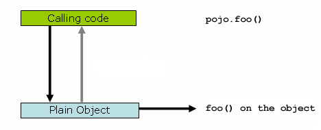
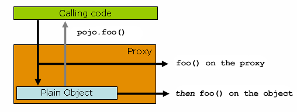
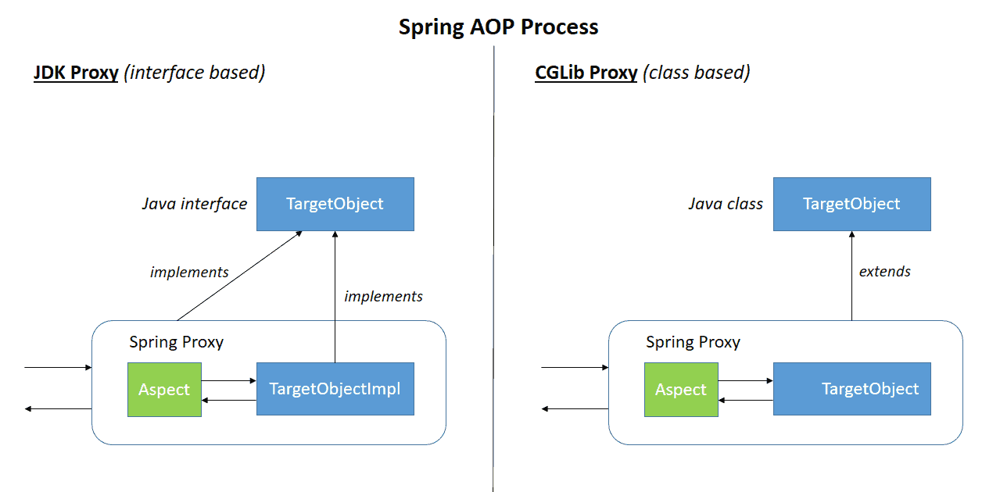
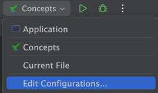
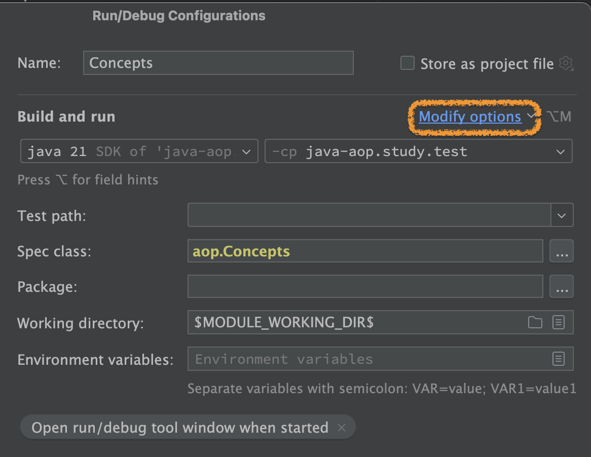
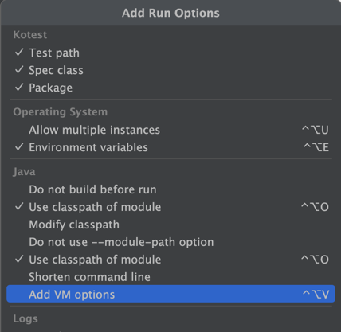
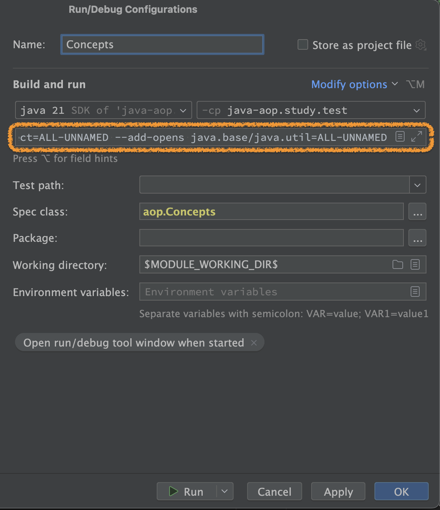

# 만들면서 배우는 스프링

## 스프링 AOP

### 학습목표
- AOP 학습 테스트로 AOP와 Proxy에 대한 이해도를 높인다.

## 준비 사항
- IntelliJ에 Kotest 플러그인 설치
- 하단의 cglib 사용시 주의사항 참고

## 학습 테스트
- 실패하는 학습 테스트를 통과시키시면 됩니다.
- 학습 테스트는 aop 패키지 또는 클래스 단위로 실행하세요.

AOP와 스프링 AOP에 대해 좀 더 자세히 알아봅시다.

AOP에서 중요한 개념은 🌟로 표시했습니다.

🌟가 붙은 단어의 설명은 주의 깊게 읽어보세요.

1. [AOP 기본 개념](src/test/kotlin/aop/Concepts.kt)
2. [스프링 AOP](src/test/kotlin/aop/SpringAOP.kt)
3. [@AspectJ](src/test/kotlin/aop/AspectJ.kt)

### Plain POJO call


### Proxy call


### JDK Proxy와 CGLib Proxy 비교


## 학습 테스트에서 cglib 사용시 주의사항

cglib를 구현할 때 스샷을 참고해서 아래 VM 옵션을 활성화한다.

```
--add-opens java.base/java.lang=ALL-UNNAMED
--add-opens java.base/java.lang.reflect=ALL-UNNAMED
--add-opens java.base/java.util=ALL-UNNAMED
```

우측 상단 Run / Debug Configurations 메뉴








